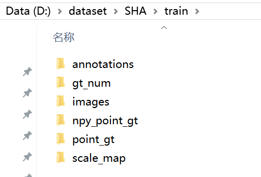
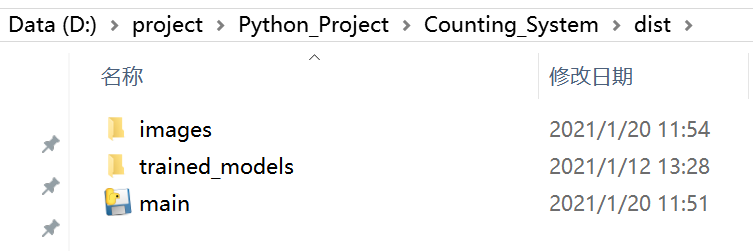

# Counting System
## Introduction
This is a software used for image level crowd counting and video level flow counting.
<br>


## Requirements Before Running
#### python packages
pytorch==1.7.1 (CPU version is enough:  <br>
pip install torch===1.7.1 torchvision===0.8.2 torchaudio===0.7.2 -f https://download.pytorch.org/whl/torch_stable.html
)
<br>
pyqt5==5.12
<br>
others:
<br>
cmake,numpy,scipy,matplotlib,tqdm

#### Development Tools
If you just want to use the software, just download a .exe from [here](https://github.com/MRJTM/Counting_System/releases)
<br>
If you want to change the UI Interface, you need to install **QT==5.12**, and use the **QT-Creator** to design the UI.


## How to Prepare Your Dataset
If you want to train a new model for your special case, you should follow the steps bellow to prepare your data.
We suppose you run all the command bellow at the root path of this project, not in the data_process folder.
<br>
And we suppose your dataset have two folders: train and test, like ShanghaiTech Part A
<br>
For train or test part, you have an images folder and gt folder in it.

#### Step1: save .npy point gt
```shell script
python data_process/save_npy_point_gt.py
```
now, you have two folders:
* images: 0001.jpg, 0002.jpg...
* npy_point_gt: 0001.npy, 0002.npy...
<br>
each xxx.npy is a two-dim numpy array [[x1,y1],[x2,y2]...]

#### Step2: generate scale map and save gt_num from npy_point_gt
```shell script
python data_process/generate_scale_map_and_gt_num.py
```
now, you have two new folders:
* scale_map: 0001.png, 0002.png...
* gt_num: 0001.npy, 0002.npy...
<br>
each gt_num file is a scalar, just an integer

#### Step3: generate COCO format ground truth
```shell script
python data_process/transform_to_COCO_format.py
```
now you have a new folder:
* annotation: head_gt.json

#### Step4: create a link in the data folder:
take ShanghaiTech Part A as an example
```shell script
ln -s your_path/SHA data/SHA
```

#### Now, your dataset is ready!!!
Like the following structure.



## How to Training Model


## How to Run Software
You have two ways to run the software:
#### 1.run from source code
```shell script
python main.py
```
#### 2.run from .exe excutable file
You can directly use the compiled .exe, which can be downloaded from [Assets](https://github.com/MRJTM/Counting_System/releases) of this project.
<br>
Or you can compile a .exe from the source code by yourself.

```shell script
pyinstaller -F -w -i images/icon.ico main.py
```
Then you will get a main.exe at the dist folder.You should put the folder "images" and "trained_modes" 
into the dist folder to be with the main.exe, like the following image. Double click the exe, ignore the 
warning showed up, it could take several seconds before the start GUI shows.



## ToDo
- [ ] train a light-weight model
- [ ] Optimize the post process of the model inference
- [ ] Optimize the tracking algorithm 
